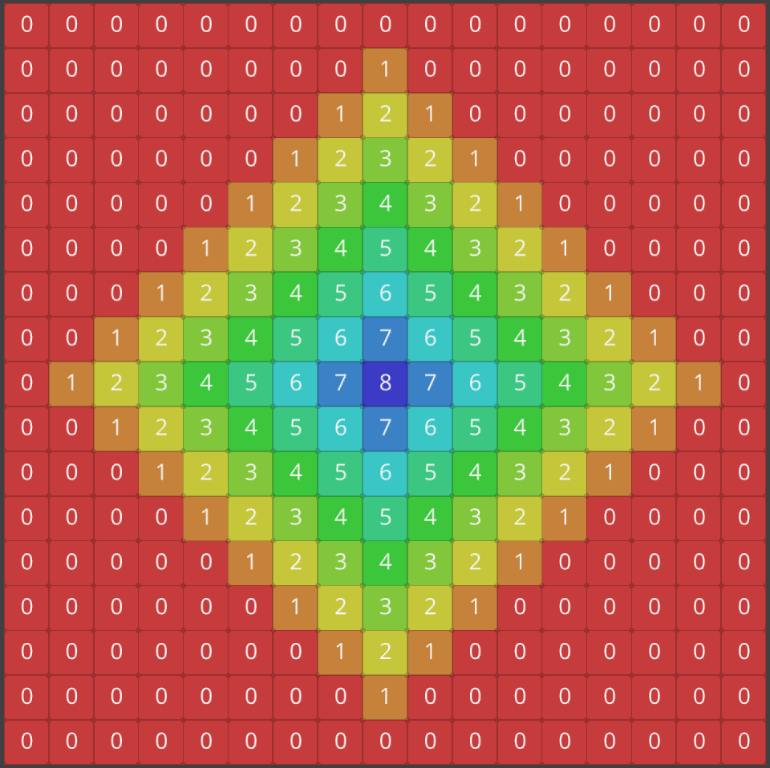
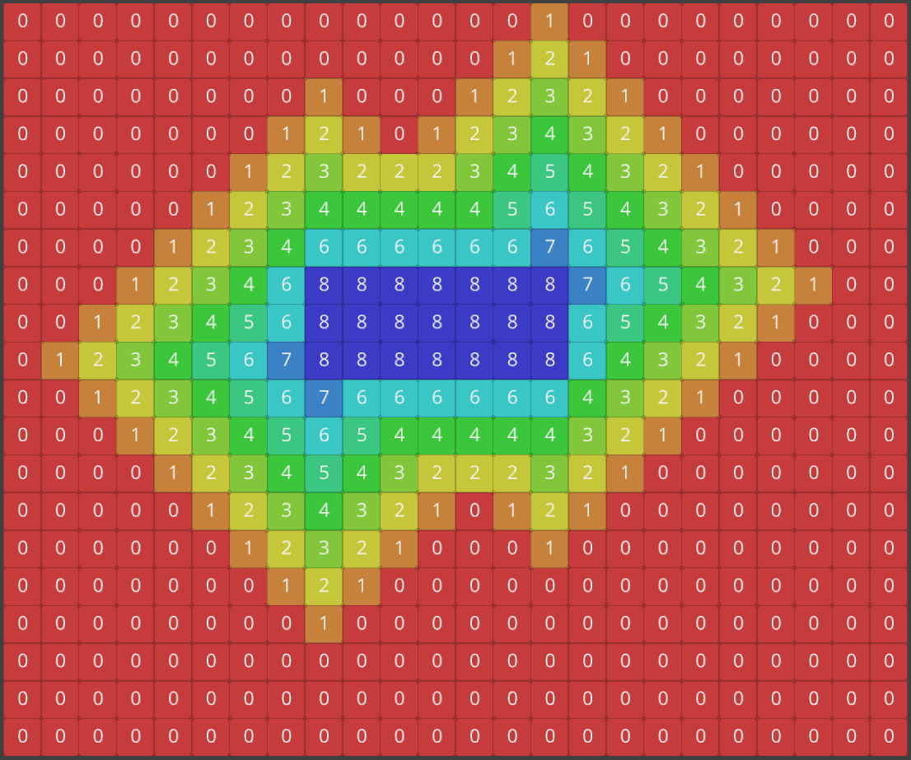
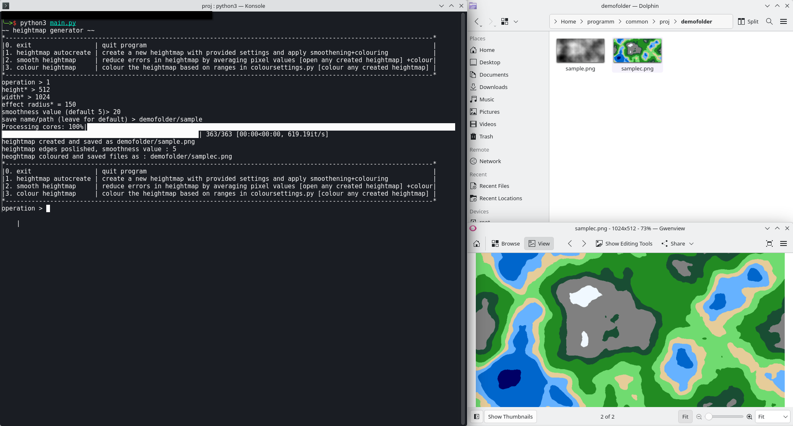
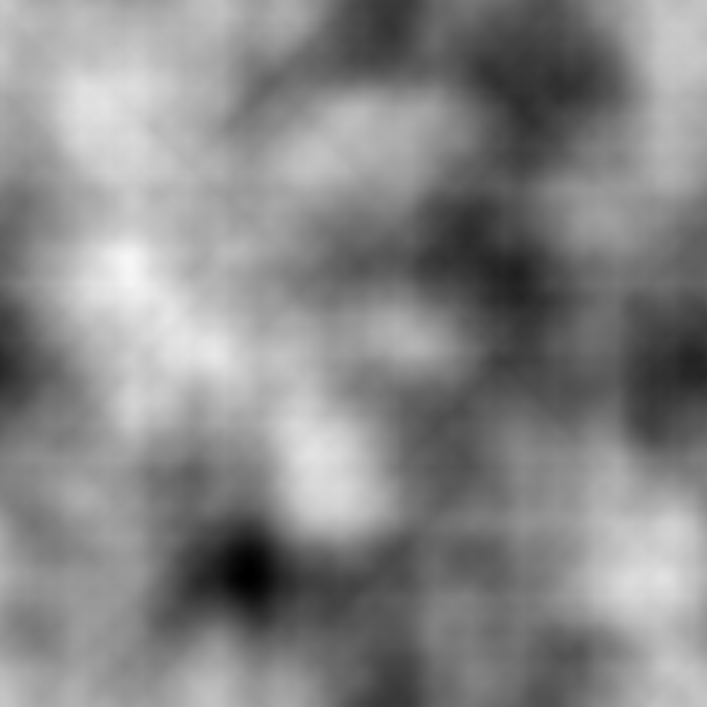
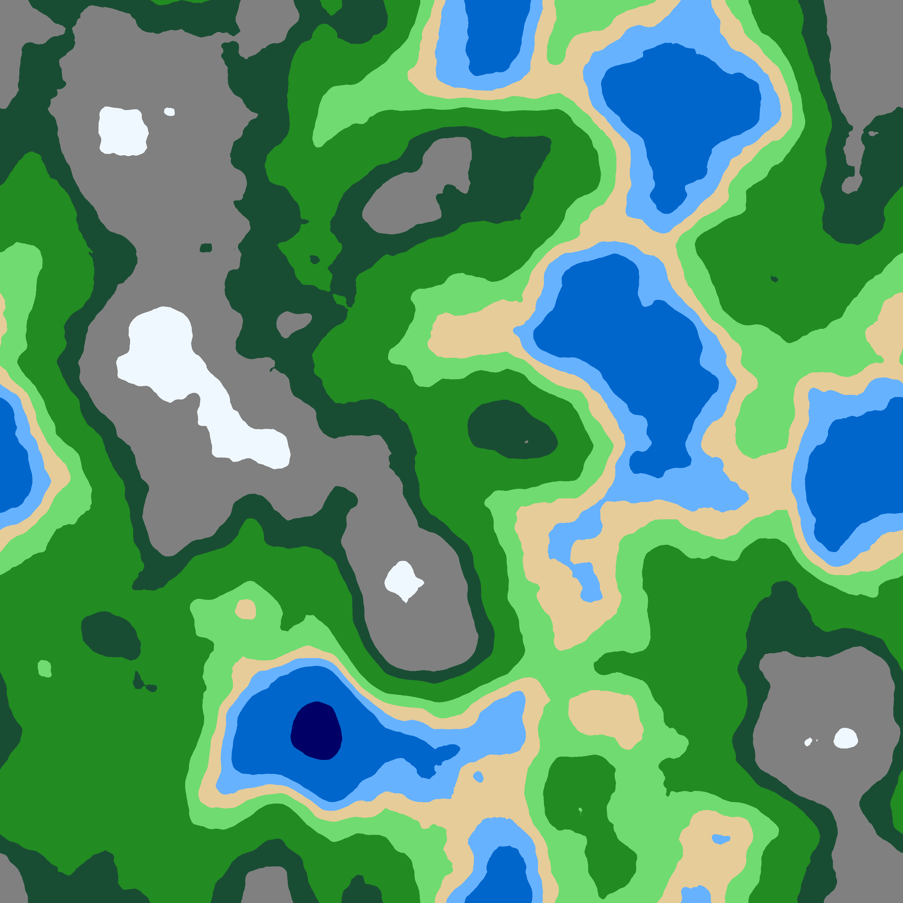
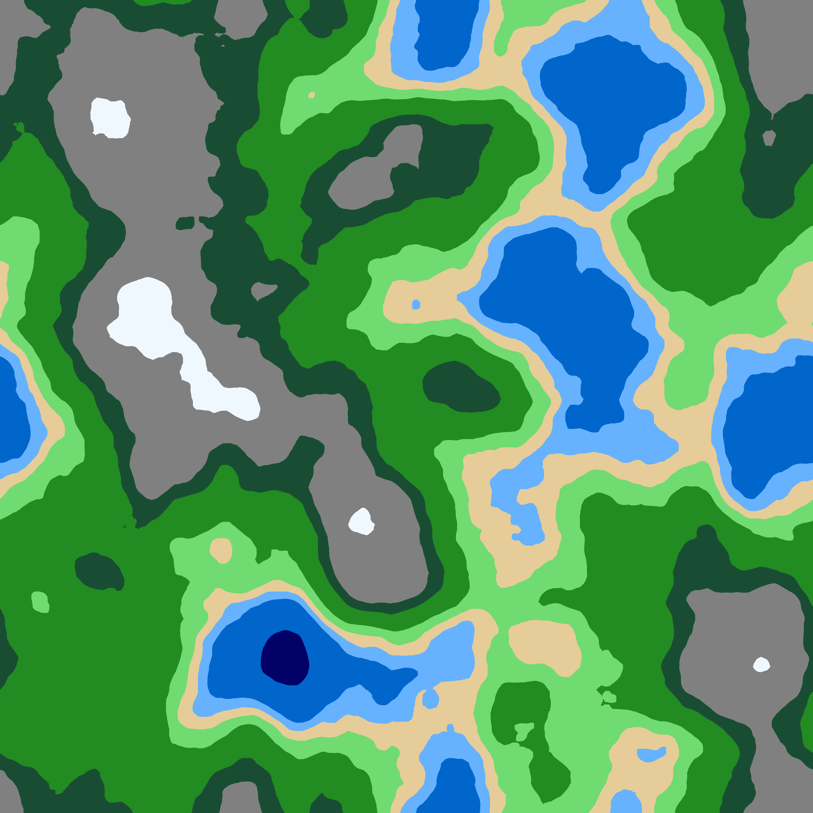
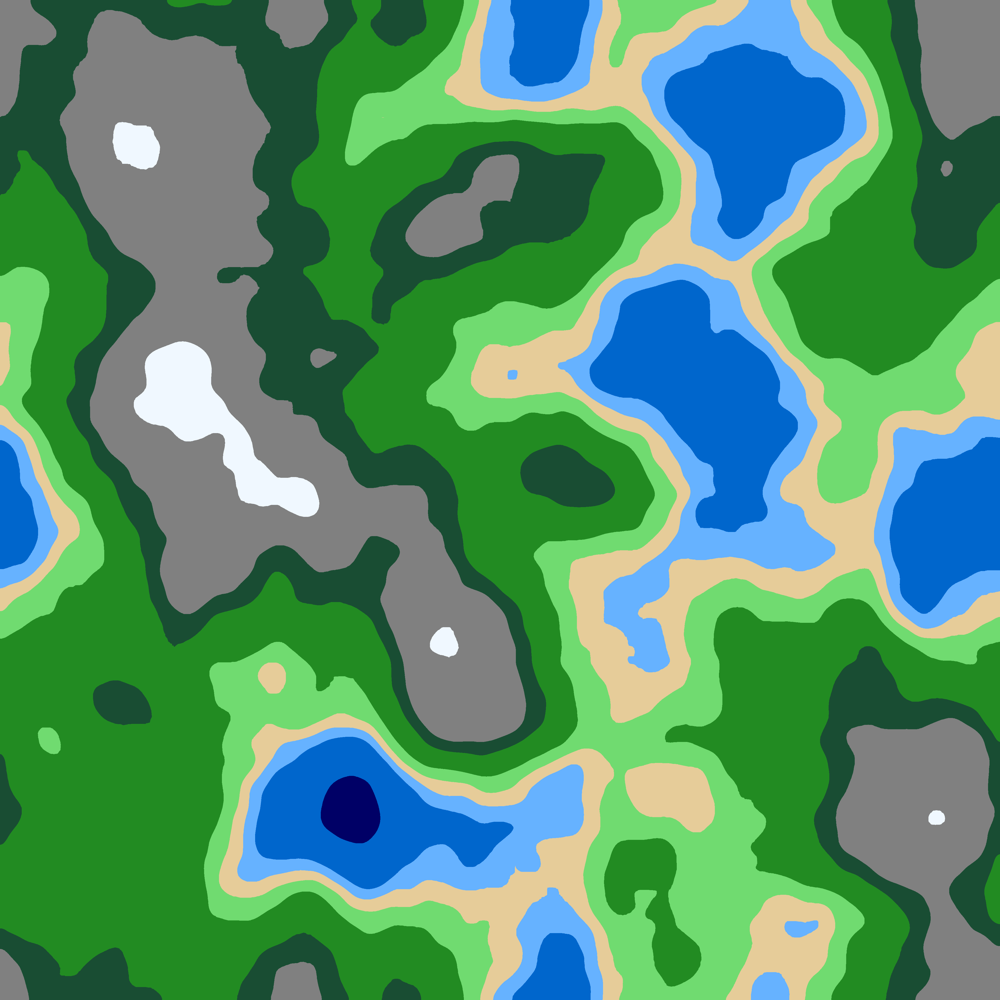

# Manhattan Distance Heightmap Generator

A python heightmap generator based on manhattan distance. 

The program creates a zero matrix of height*width, then randomly generates centres which have an initial height (cap). The values spread out from these centres until they reach 0. Overlapping values are added together, creating the terrain.

<p float="left">
  
  
</p>

## Features
* Colours can be edited in coloursettings.py
* Includes a crude terminal interface to create maps, smoothen them, or colour them.
* Can be run directly or imported as a module.
<p float="left">
  
</p>
CLI interface

## Samples

<p float="left">
  
  
</p>
raw heightmap and coloured heightmap

### Effect of Smoothner
<p float="left">
  
  
  
</p>
heightmaps smoothened with values 5, 15, 50 respectively

the smoothening happens by averaging the values of neighbourhood values

## Dependencies

This project requires the following python libraries:
* numpy
* PIL
* tqdm

## How to use

To start the terminal interface:
```bash
python3 main.py
```

Or Driver.py can directly be imported into yout code
